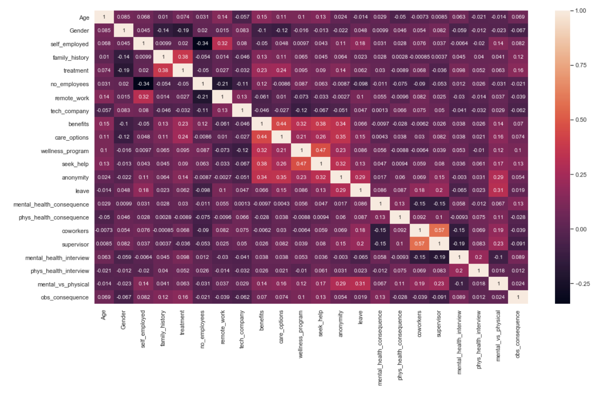

# Mental Health In Tech Workplaces
* Problem Statment:
 Many risk factors are present in the workplace such as: 
  - inadequate health and safety policies 
  - low control over one's area of work 
  - poor communication and management practices
  - workload, inflexible working hours
Absenteeism and disability costs have increased in the workplace due to mental illness. 
Early identification and intervention of mental health issues will have significant impact on preventing underperformance, excessive absenteeism, and other related problems.
* Solution Proposal:
  -Conduct a predictive analysis of data from pre-screening surveys
  -Use four different models to determine key indicators of mental health issues in the technology workplace.
  -Propose solutions to mitigate these concerns based on the results of research conclusions.
* The Process:
  - Selected data sources and cleaned data
  -Selected four models for analysis
    + Logistics Regression
    + Support Vector Machine
    + Decision Tree
    + Random Forest GridSearchCV
  - Determined and selected the model with the best results
  - Analyzed results for primary indicators
  - Developed conclusions and recommendations
* Data Distribution, supporting details of four models using in analysis can be found in project5.ipynb
* Upload Mental Health DataFrame:

* Relationships between target variable - seeking treatment - vs independent variables

* Conclusions:
  - Based on our models, the most important indicators for a mentally healthy and stable workforce are:
      + Family history
      + Available care options
      + Employee healthcare benefits
      + A leave plan to address family related mental health issues. 
 * Recommendations:
    - Use the screening survey as an initial indicator of potential mental issue
    - The company should retains mental health professionals and counselors on its staff.
    - The company's healthcare benefits plan should  include
    - Provisions for extensive non-gender specific mental healthcare
    - Leave for employees and their family members without any age limitation.
 * Next Steps:
    - Discuss recommendations with primary insurance providers
    - Discuss recommendations with primary workforce representative
    - Discuss an implementation plan and timeline with HR
    - Implement all recommendations
    - Employees that indicate previously identify mental health issue in their family or extended family should receive an in depth assessment.

    
