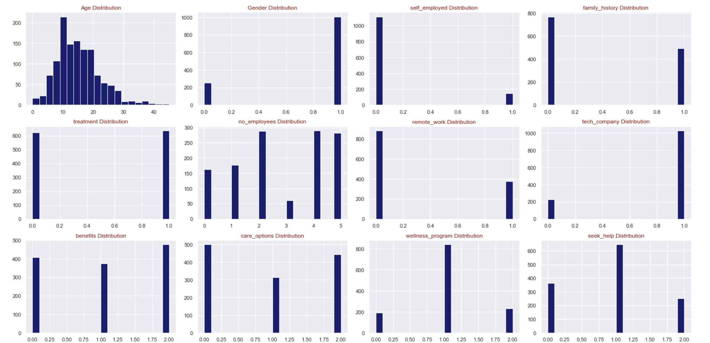
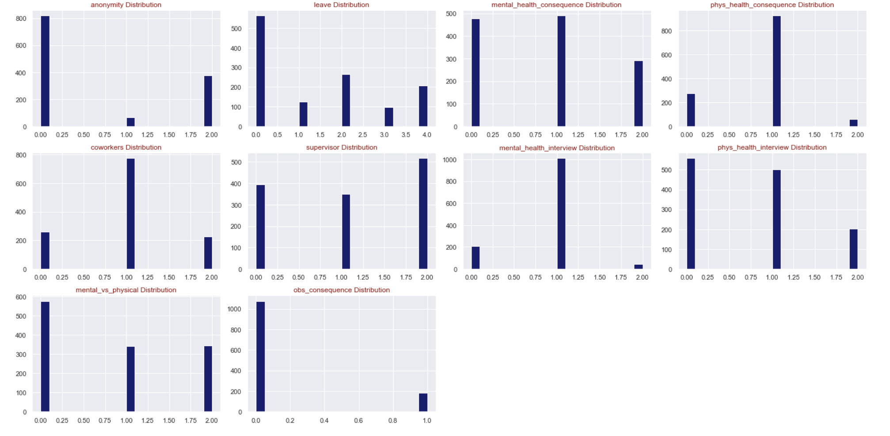
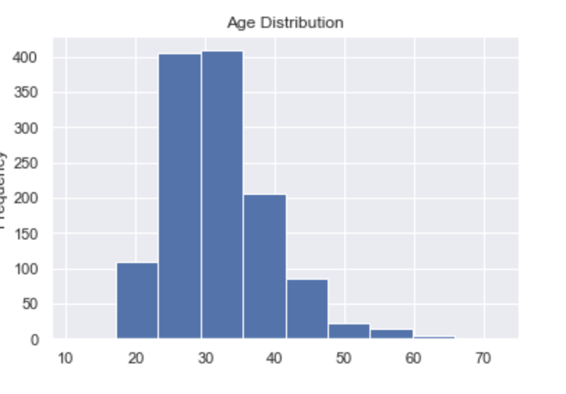

### Mental Health In Tech Workplaces
##### I. Problem Statment:
    Many risk factors are present in the workplace such as: 
     - inadequate health and safety policies 
     - low control over one's area of work 
     - poor communication and management practices
     - workload, inflexible working hours
   * Absenteeism and disability costs have increased in the workplace due to mental illness. 
   * Early identification and intervention of mental health issues will have significant impact on preventing underperformance, excessive absenteeism, and other related problems.

##### II. Solution Proposal:
    * Conduct a predictive analysis of data from pre-screening surveys
    * Use four different models to determine key indicators of mental health issues in the technology workplace.
    * Propose solutions to mitigate these concerns based on the results of research conclusions.

##### III. The Process:
  - Selected data sources and cleaned data
  -Selected four models for analysis
    + Logistics Regression
    + Support Vector Machine
    + Decision Tree
    + Random Forest GridSearchCV
  - Determined and selected the model with the best results
  - Analyzed results for primary indicators
  - Developed conclusions and recommendations
1. Data Distribution:

* Key Takeaways:
 * This is a survey data from some Tech companies.
     - A plot with 2 columns are associated with the answer yes or no
     - A 3 columns distrubition are associated with yes, no, and maybe answers
     - 4 columns: Never, sometime, most of the time, often
     - 5 columns: No,somewhat easy, somewhat difficult, not at all , difficult

2. Construct a heatmap/correlation matrix:
    * A heatmap is a graphical representation of data where values are depicted by color. It also shows a correlation matrix depicting linear correlation coefficients between variables.

* Some notes from our correlation coefficients between independent variables:
    * Coworkers vs supervisor: Coeff = 0.57
    * Wellness program vs Seek help: Coeff = 0.47
    * Benefits vs Care-option: Coeff = 0.44
    * Family history vs treatment: Coeff = 0.38
    * Leave vs mental mental and physical: Coeff = 0.31
    * Remote work vs self employed: Coeff = 0.32

* Age distribution among survey-employees

* Gender that is most likely seeking treatment is female and that is understandable

* Conclusions:
  - Based on our models, the most important indicators for a mentally healthy and stable workforce are:
      + Family history
      + Available care options
      + Employee healthcare benefits
      + A leave plan to address family related mental health issues. 

* Recommendations:
    - Use the screening survey as an initial indicator of potential mental issue
    - The company should retains mental health professionals and counselors on its staff.
    - The company's healthcare benefits plan should  include
    - Provisions for extensive non-gender specific mental healthcare
    - Leave for employees and their family members without any age limitation.
 
 * Next Steps:
    - Discuss recommendations with primary insurance providers
    - Discuss recommendations with primary workforce representative
    - Discuss an implementation plan and timeline with HR
    - Implement all recommendations
    - Employees that indicate previously identify mental health issue in their family or extended family should receive an in depth assessment.

    
